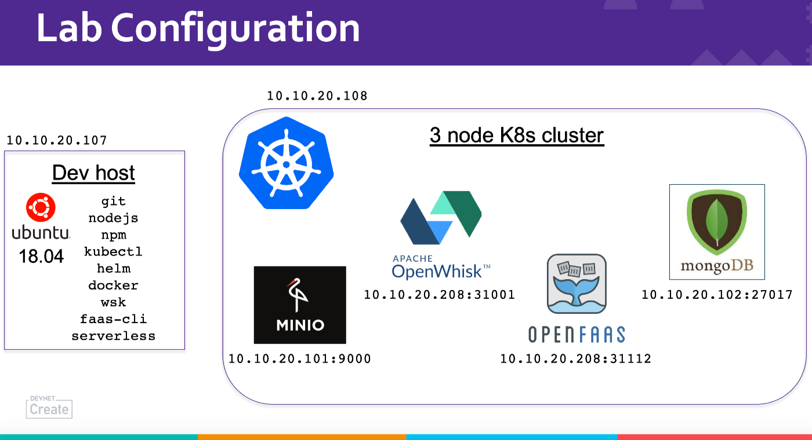

# FONK: FaaS on K8S Working Examples
Welcome to the lab materials for the DevNet Create session on FONK: FaaS on K8S Working Examples. In these two labs, you'll be deploying a Serverless version of Guestbook whose back ends run on OpenWhisk and OpenFaaS so that you can see not only how easy serverless web apps are to construct but also the differences between these two FaaS on K8s solutions.

For your lab access, you should have a piece of paper that tells you how to use Cisco AnyConnect to VPN into your environment and also a thumb drive that contains a .pem file so that you can log into your dev host that already has all the client software you'll need installed on it.  Here are the major components of the environment you'll be using:

